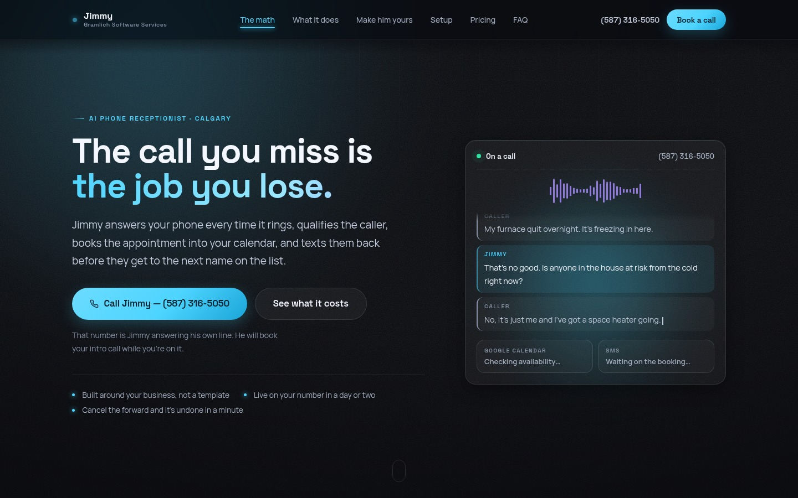
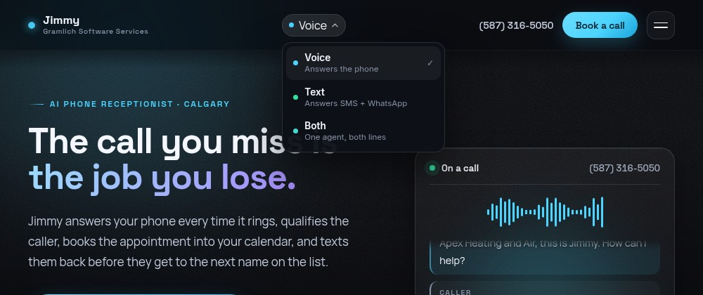
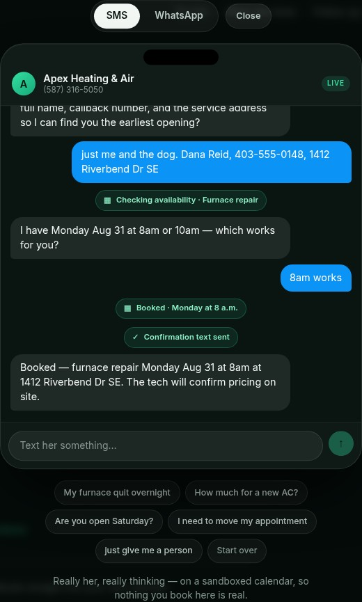
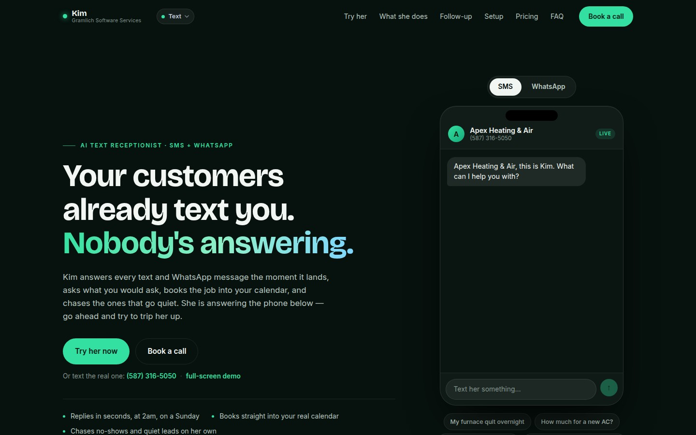
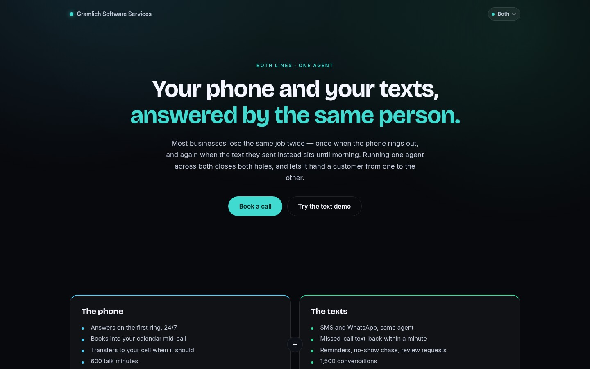

# AI Receptionist — phone and text

Two products on one agent. **Jimmy** answers the phone; **Kim** answers SMS and
WhatsApp and chases the follow-ups nobody in a busy shop has time for. Both book
into the same Google Calendar, escalate to a human when they should, and are
configured per client by one JSON file.

Live at **[reception.rileygramlich.dev](https://reception.rileygramlich.dev)** —
the number on the site is the agent answering its own line.



---

## The two products

| | | |
|---|---|---|
| **Voice** | `/` | Answers on the first ring, books mid-call, transfers to a human |
| **Text** | `/text` | SMS + WhatsApp, plus missed-call text-back, reminders, no-show chase, review requests |
| **Both** | `/both` | One agent across both, one calendar, one summary feed |

One site, one switcher in the nav:



---

## The text product answers for real, on the page

`/demo` runs the **actual** agent — same prompt, same tool definitions a client
gets — against a sandboxed calendar. Nothing you do there books a real slot or
texts a real person, and it says so.



Those chips are the argument. Without them it reads as a chatbot; with them it
reads as a receptionist doing the work between messages.

It is capped per visitor and per day, and falls back to a scripted conversation
that admits it is one, rather than pretending or erroring. A prospect who
catches a "live" demo being canned has learned something worse than that you
rate-limit.



---

## How a call flows

```
Caller dials client's number
  → Twilio hits POST /voice
  → TwiML opens a ConversationRelay WebSocket
  → Twilio does speech-to-text, sends us plain text
  → the agent runs Claude with tools
      check_availability → Google Calendar freebusy
      book_appointment   → creates event, SMS to caller
      take_message       → SMS to owner
      transfer_to_human  → live call redirect
  → we send text back, Twilio speaks it
  → on hangup: call summary SMS to owner + calls.jsonl
```

ConversationRelay handles barge-in, turn detection, STT and TTS. That is the
part most people get wrong when they build this from raw media streams, and it
is why the codebase is this small.

## How a text thread flows

The same agent and the same tools with a channel-aware prompt. Threads idle out
after 30 minutes, turns are serialised per sender so rapid texts cannot answer
out of order, and the webhook acks immediately and replies over the REST API —
a tool loop that hits the calendar can outrun Twilio's 15-second webhook timeout.

SMS and WhatsApp are the same thread object behind a transport interface. The
awkward part is Meta's: outside 24 hours of the customer's last message, only a
pre-approved template may be sent, so the scheduler checks that window before
every send rather than discovering it as error 63016.

### Outbound

Four moments where the business speaks first — missed-call text-back,
appointment reminders, no-show follow-up, review requests. Every job clears
opt-out, quiet hours (9am–8pm in the customer's timezone) and the WhatsApp
window **at send time, not queue time**, because all three can change while a
job waits.

`STOP` is matched on the whole message, so "stop by around four?" stays a normal
question. There is a test for exactly that.

Full detail: **[docs/SMS-WHATSAPP.md](docs/SMS-WHATSAPP.md)**.

---

## What's in this repository

| | |
|---|---|
| `src/server.js` | Voice: Twilio webhooks, ConversationRelay socket, tenant routing |
| `src/server-text.js` | Text: SMS/WhatsApp webhooks, demo API, outbound scheduler |
| `src/channels/` | Transport interface — SMS and WhatsApp, incl. the 24-hour rules |
| `src/threads.js` | Channel-agnostic thread state |
| `src/outbound/` | Scheduler, the four triggers, opt-out suppression list |
| `src/demo/` | The public demo: sandboxed tools, rate limits, scripted fallback |
| `site-web/` | The marketing site — both products, the bundle, the demo |
| `preflight.js` | Startup checks: credentials, calendar reachability, tenant config |
| `business.example.json`, `business.text.example.json` | The full per-tenant config shapes |
| `test/` | 52 assertions over opt-out, scheduling, triggers, WhatsApp rules, sandbox |

### What's not in it

The conversation layer — the system prompt, the streaming tool loop, and the
Calendar/Twilio tool implementations — is not published. That is the part that
took the iterations and it is what the business actually sells.

What that means practically: **this repository documents the architecture, it
does not run as-is.** It is here to show how the thing is put together, not to
be cloned into a competitor. If you want to see it work, call the number on the
site or text the demo.

---

## The bundle



---

## Per-tenant configuration

Everything client-specific is one JSON file. Nothing else changes per client.

```jsonc
{
  "name": "Northline Plumbing",
  "receptionistName": "Kim",
  "channels": {
    "sms":      { "number": "+14035551234" },
    "whatsapp": { "useSandbox": true, "sender": null }
  },
  "hours":    { "mon": ["08:00", "17:00"], "sat": null, "...": "..." },
  "services": [{ "name": "Emergency call-out", "durationMin": 90, "urgent": true }],
  "booking":  { "calendarId": "...", "bufferMin": 30, "minNoticeMin": 120 },
  "escalation": {
    "transferTo": "+14035559876",
    "transferWhen": "caller is angry, mentions a flood or gas smell, or asks for a human"
  },
  "outbound": {
    "missedCallTextBack": { "enabled": true, "graceSeconds": 45 },
    "reminders":          { "enabled": true, "leadHours": 18 },
    "noShowFollowUp":     { "enabled": true, "delayMinutes": 90 },
    "reviewRequests":     { "enabled": true, "delayHours": 3, "link": "..." }
  },
  "faq":      [{ "q": "Do you charge for quotes?", "a": "Quotes are free within Calgary." }],
  "neverSay": ["Do not quote a dollar price. Say a technician confirms pricing on site."]
}
```

`neverSay` and the FAQ do most of the safety work: the agent will not state a
price, a warranty term, or a legal opinion unless it appears verbatim in the
FAQ, and then only quoted exactly. It will not give out a phone number or link
that is not in the brief either — in an emergency a wrong number is worse than
none.

### Onboarding a client

1. Fill in the JSON — hours, services with real durations, service area, FAQ,
   escalation rules, `neverSay`, and which follow-ups they want sending.
2. Get calendar access.
3. Test it yourself ten times, including the awkward ones: mumbling, background
   noise, "just give me a person," someone who changes their mind mid-booking.
4. Forward their existing number. Forwarding first is the low-risk way in — they
   keep their number and can undo it in a minute.

Budget 2–3 hours per client. Most of it is on the phone with the owner,
extracting what they actually say to callers.

---

## Deployment

Public hostname with WebSocket support, Docker, TLS via Caddy or an existing
reverse proxy.

```bash
cp .env.example .env      # Anthropic, Twilio, Google service account, PUBLIC_HOSTNAME
docker compose up -d                          # voice
cd site-web && docker compose up -d --build   # site + text server
```

| Webhook | Points at |
|---|---|
| Voice | `POST https://HOST/voice` |
| Voice status (drives missed-call text-back) | `POST https://HOST/voice/status` |
| Messaging, SMS number | `POST https://HOST/sms` |
| Messaging, WhatsApp sender | `POST https://HOST/whatsapp` |

`/text`, `/both` and `/demo` are client-side routes, so nginx needs
`try_files $uri $uri/ /index.html` — it is in `site-web/nginx.conf`.

### Before texting at volume

**A2P 10DLC** carrier registration is required in the US and Canada, and
**WhatsApp Business** needs Meta's approval on the profile and on each template.
Both take days to weeks. Everything else works before either lands, which is
what the WhatsApp sandbox path is for. Do not point a client's real number at
this before registration clears.

---

## Rough per-minute cost

| | |
|---|---|
| Twilio voice + ConversationRelay (STT/TTS bundled) | ~$0.15–0.20/min |
| Claude Sonnet at these turn sizes | ~$0.02–0.05/min |
| SMS | pennies |

Call it **$0.25/min all-in**. A client taking 200 calls a month at 3 minutes
each is 600 minutes — about **$150 in cost**.

---

## Not built yet

- **Client dashboard.** Call log, transcripts, recordings. `calls.jsonl` is the
  data; the UI is a weekend.
- **No-show detection is manual.** The trigger exists and is tested; nothing
  calls it yet.
- **`lastInboundAt` is in memory**, so a restart treats open WhatsApp windows as
  closed. Safe direction to fail, but it costs real reminders.
- **Bilingual.** Deepgram and ElevenLabs both do French; a config change plus
  prompt work.
- **Recording consent announcement** — required in Alberta if you record.

---

Built by [Gramlich Software Services](https://reception.rileygramlich.dev), Calgary.
