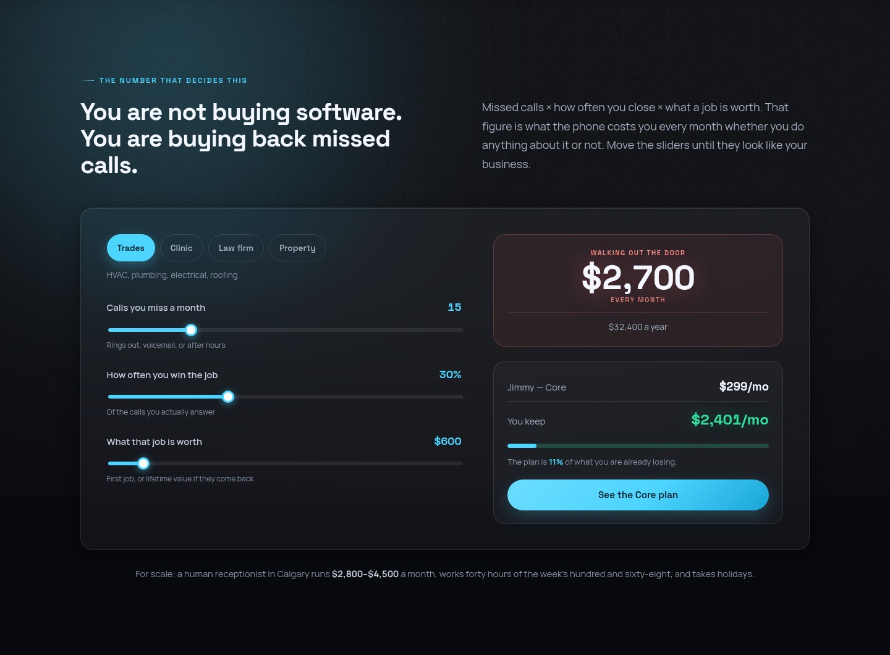
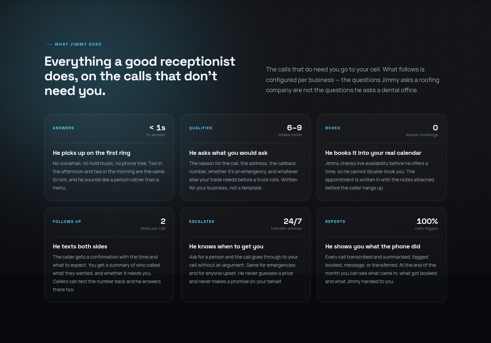
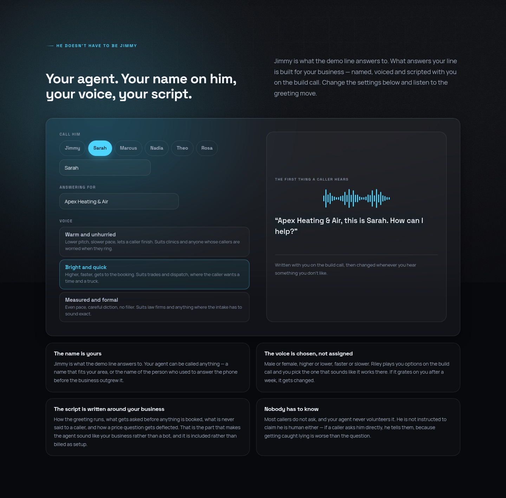

# Jimmy — AI Phone Receptionist

Answers the phone on the first ring, qualifies the caller, books into Google Calendar, texts both sides, and hands the call to a human when it should. One deployment serves every client.

Live at **[reception.rileygramlich.dev](https://reception.rileygramlich.dev)** — the number on the site is the agent answering its own line.


---

## The pitch, in one number

A missed call is a lost job. The site opens with a calculator instead of a feature list, because for most trades the arithmetic settles it before any demo does.



---

## What the agent actually does

Six behaviours, all configured per business — the questions it asks a roofing company are not the questions it asks a dental office.



Name, voice and script are chosen per client on the build call, not assigned:



---

## How a call flows

```
Caller dials client's number
  → Twilio hits POST /voice
  → TwiML opens a ConversationRelay WebSocket
  → Twilio does speech-to-text, sends us plain text
  → the agent runs Claude with tools
      check_availability → Google Calendar freebusy
      book_appointment   → creates event, SMS to caller
      take_message       → SMS to owner
      transfer_to_human  → live call redirect
  → we send text back, Twilio speaks it
  → on hangup: call summary SMS to owner + calls.jsonl
```

ConversationRelay handles barge-in, turn detection, STT and TTS. That is the part most people get wrong when they build this from raw media streams, and it is why the codebase is this small.

SMS reuses the same conversation and the same tools with a channel-aware prompt. Threads idle out after 30 minutes, turns are serialised per sender so rapid texts cannot answer out of order, and the webhook acks immediately and replies over the REST API — a tool loop that hits the calendar can outrun Twilio's 15-second webhook timeout, and a timed-out webhook shows the texter an error.

---

## What's in this repository

| | |
|---|---|
| `src/server.js` | Twilio webhooks, ConversationRelay socket, tenant routing by phone number |
| `src/sms.js` | Inbound SMS: thread state, per-sender turn serialisation, idle-out |
| `preflight.js` | Startup checks — credentials, calendar reachability, tenant config validation |
| `business.example.json` | The complete per-tenant config shape, fully commented by example |
| `Dockerfile`, `docker-compose*.yml`, `Caddyfile` | Deployment, including the behind-a-proxy variant |
| `site/` | The React landing page above, in full |

### What's not in it

The conversation layer — the system prompt, the streaming tool loop, and the Calendar/Twilio tool implementations — is not published. That is the part that took the iterations and it is what the business actually sells.

What that means practically: **this repository documents the architecture, it does not run as-is.** It is here to show how the thing is put together, not to be cloned into a competitor. If you want to see it work, call the number on the site.

---

## Per-tenant configuration

Everything client-specific is one JSON file. Nothing else changes per client.

```jsonc
{
  "name": "Northline Plumbing",
  "twilioNumber": "+14035551234",
  "receptionistName": "Ava",
  "greeting": "Thanks for calling Northline Plumbing, this is Ava. How can I help?",
  "hours":    { "mon": ["08:00", "17:00"], "sat": null, "...": "..." },
  "services": [{ "name": "Emergency call-out", "durationMin": 90, "urgent": true }],
  "booking":  { "calendarId": "...", "bufferMin": 30, "minNoticeMin": 120 },
  "escalation": {
    "transferTo": "+14035559876",
    "transferWhen": "caller is angry, mentions a flood or gas smell, or asks for a human"
  },
  "faq":      [{ "q": "Do you charge for quotes?", "a": "Quotes are free within Calgary." }],
  "neverSay": ["Do not quote a dollar price. Say a technician confirms pricing on site."]
}
```

See [`business.example.json`](business.example.json) for the full shape. `neverSay` and the FAQ do most of the safety work: the agent will not state a price, a warranty term, or a legal opinion unless it appears verbatim in the FAQ, and then only quoted exactly.

### Onboarding a client

1. Fill in the JSON — hours, services with real durations, service area, FAQ, escalation rules, `neverSay`.
2. Get calendar access.
3. Test-call it yourself ten times, including the awkward ones: mumbling, background noise, "just give me a person," a caller who changes their mind mid-booking.
4. Forward the client's existing number. Forwarding first is the low-risk way in — they keep their number and can undo it in a minute.

Budget 2–3 hours per client. Most of it is on the phone with the owner, extracting what they actually say to callers.

---

## Deployment

Public hostname with WebSocket support, Docker, TLS via Caddy.

```bash
cp .env.example .env      # Anthropic, Twilio, Google service account, PUBLIC_HOSTNAME
docker compose up -d
```

Point the Twilio number's voice webhook at `https://YOUR_HOST/voice` and its messaging webhook at `/sms`. Google Cloud needs a service account with the Calendar API enabled and domain-wide delegation, with the client granting access to the booking calendar — or swap to per-tenant OAuth refresh tokens if clients are on personal Gmail.

`docker-compose.behind-proxy.yml` is the variant for when something else already owns :443.

---

## Rough per-minute cost

| | |
|---|---|
| Twilio voice + ConversationRelay (STT/TTS bundled) | ~$0.15–0.20/min |
| Claude Sonnet at these turn sizes | ~$0.02–0.05/min |
| SMS | pennies |

Call it **$0.25/min all-in**. A client taking 200 calls a month at 3 minutes each is 600 minutes — about **$150 in cost**.

---

## Not built yet

- **Client dashboard.** Call log, transcripts, recordings. `calls.jsonl` is the data; the UI is a weekend.
- **Outbound follow-up** calls for no-shows.
- **Bilingual.** Deepgram and ElevenLabs both do French; it is a config change plus prompt work.
- **Recording consent announcement** — required in Alberta if you record. If Twilio recording is enabled, the greeting needs a consent line first.

---

Built by [Gramlich Software Services](https://reception.rileygramlich.dev), Calgary.
